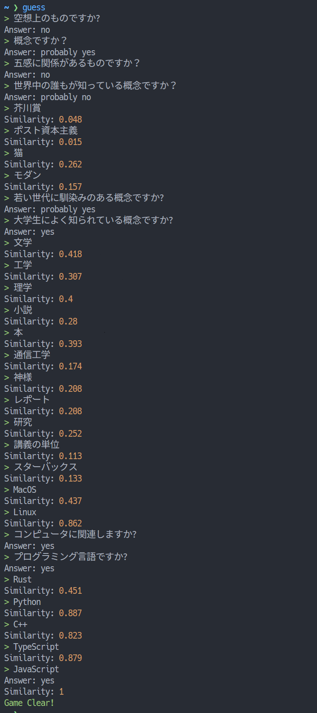

# Guess

Guess the target word

## Requirements

- [Deno](https://deno.land/)

## セットアップ

```bash
# Set the OpenAI API key
$ export OPENAI_API_KEY=<your key here>
# Install the command
$ deno install -f --allow-env --allow-net -n guess https://raw.githubusercontent.com/kaiiy/guess/v0.1.2/cli.ts
```

## 遊び方

単語を当てるゲームです。

```bash
# ゲーム開始
$ guess
```

- 質問 (「?」か「？」で終わる文) を入力すると、yes/probably yes/unknown/probably no/no の5段階で答えてくれます。
- それ以外の文・単語を入力すると、正解の単語との類似度を答えてくれます。

正解の単語を当てたらクリアです。何も入力せずにエンターを押した場合、正解の単語を表示しゲームを終了します。

